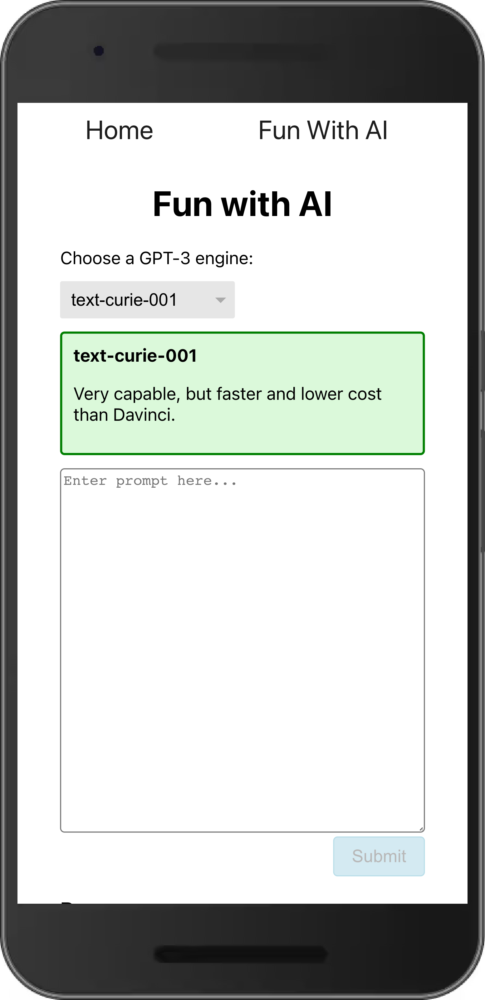
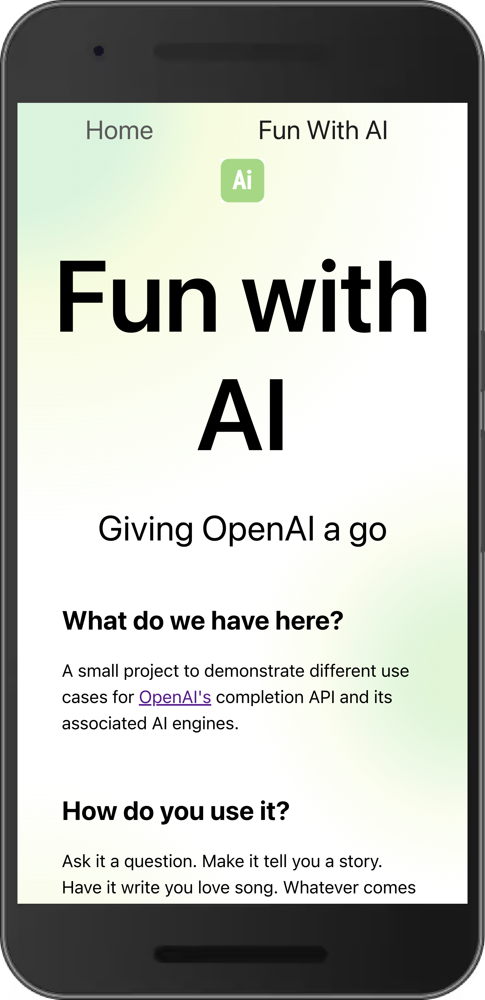
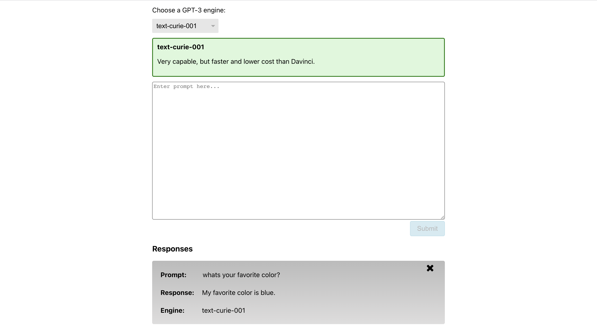

# OpenAI Shopify Challenge

## Description

A React application built as part of the Shopify Fall 2022 front end challenge.

<div style='display: flex; padding:20px'>
  <span style='display: flex; justify-content: center; align-items:center'>
    
  </span>
  <span style='display: flex; justify-content: center; align-items:center'>
    
  </span>
</div>
<div style='display: flex; padding-bottom: 20px;'>
  <span style='display: flex; justify-content: center; align-items:center'>
    
  </span>
  <span style='display: flex; justify-content: center; align-items:center'>
    
  </span>
</div>

## Technologies / Libraries Used

- [ReactJS](https://reactjs.org/)
- [React Router](https://reactrouter.com/docs/en/v6)
- [OpenAI](https://openai.com/)
- [LocalStorage](https://developer.mozilla.org/en-US/docs/Web/API/Window/localStorage)
- [SCSS](https://sass-lang.com/)
- [FontAwesome](https://fontawesome.com/)

## Features

- Communicate with OpenAI API.
- Switch between several AI engines and view corresponding descriptions of said AI.
- AI responses are persisted through the use of localstorage.
- Delete previous responses.
- Submissions are disabled until all required inputs are filled.
- Button displays loading icon while API does its magic.

### Setup

- Clone this repository.
- Install dependencies
  ```
  npm i
  ```
- Add .env file at the root directory of project. within .env include:
  ```
  REACT_APP_OPENAI_API_KEY=<API key from https://openai.com/api/>
  ```
- Run the application in development:
  ```
  npm start
  ```
- Go to [localhost:3000](http://localhost:3000/).

## Hosting

Continuous deployment through Netlify.

[](https://app.netlify.com/sites/openaishopify/deploys)

You can view the live project [here](https://openaishopify.netlify.app/)
